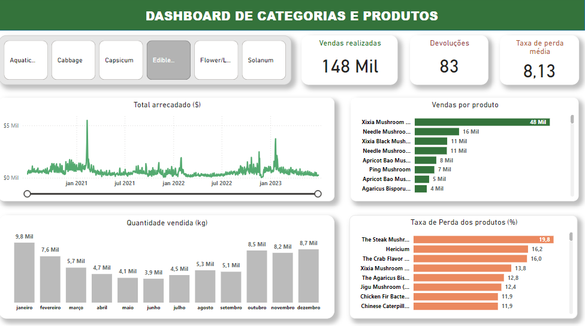

# **Projeto de Análise de Dados - Vendas de vegetais em um mercado**

---------------------

## **1. Apresentação**

### **1.1. Problemas, questões e observações de negócio**
- Foram observados desperdícios de alguns vegetais ao longo do tempo
- Falta de entendimento da sazonalidade das vendas (relacionada a períodos de alta e baixa demanda)
- Quais categorias de vegetais merecem atenção
- Quais produtos estão com taxas de perda ruins?

### **1.2. Contexto das pastas e arquivos do repositório**

- data
  - Link do Kaggle, de onde os dados foram baixados
- function
  - Pasta que foi utilizada para armazenar funções relacionadas a gráficos, para deixar o código mais limpo
- images
  - Todas as imagens geradas nas análises
- notebooks
  - Arquivos .ipynb (cadernos Jupyter), onde o projeto foi feito
- requirements
  - Todas as bibliotecas utilizadas no projeto, junto com suas versões

### **1.3. O que foi atualizado com relação ao projeto antigo?**

|                     Projeto anterior (9 meses antes)                |                                              Projeto atual                                      |
| --------------------------------------------------------------------|-------------------------------------------------------------------------------------------------|
| Código não versionado com Git                                       |   Código versionado com o Git, permitindo voltar a estágios anteriores                          |
| Apenas um notebook de análise exploratória                          |   Pastas organizadas de acordo com sua finalidade                                               |
| Informações todas juntas                                            |   Análises separadas por tema e contextualizadas                                                |
| As imagens não foram incluídas no repositório                       |   Todas as imagens foram disponibilidas no repositório                                          |
| Não foram abordados/levantados possíveis problemas de negócio       |   Foram levantadas questões e possíveis problemas que o negócio enfrenta                        |
| Visualizações mais simples                                          |   Gráficos contextualizados e com algumas explicações                                           |
| README com explicações breves                                       |   README mais detalhado e explorando melhor o que foi feito                                     |
| Sem arquivos extras                                                 |   Criação de Dashboard no Power BI com informações valiosas                                     |

### **1.4. Fonte das bases de dados**
- Link Kaggle: https://www.kaggle.com/datasets/yapwh1208/supermarket-sales-data

---------------------

## **2. Contexto dos cadernos**

### **2.1. EDA 01 - Taxas de perdas**

Nesse notebook o foco principal foi avaliar as taxas de perda dos produtos, que já vinham em uma base separada. Junto a isso, foram analisadas  diversas situações interligadas, como:
- Taxas de perda média das categorias
- Análises individuais de produtos com maiores taxas
- Visualizações dos quartis e outliers das taxas por categoria, utilizando Boxplots

### **2.2. EDA 02 - Análise de vendas**

Nesse notebook explorei melhor fatores como o tempo, analisando períodos de vendas, quantidades vendidas, total arrecadado, vendo tópicos como:
- Percentual de vendas (proporção) das categorias ao longo dos meses
- Total de vendas por hora
- Total de vendas por hora, de acordo com o dia da semana
- Produtos mais vendidos por hora (contagem das vendas em si)
- Análises dos produtos mais vendidos
- Comparação dos ganhos ($) entre as categorias

### **2.3. EDA 03 - Análise das categorias individualmente**

Conjunto de seis notebooks (um para cada categoria), onde exploro mais afundo alguns fatores que podem ser relevantes para o negócio, como:

- Percentual de vendas (proporção) dos produtos, de acordo com as horas
- Visualizando as vendas por dia da semana
- TOP 10 produtos mais vendidos
- Série temporal da categoria
- Visualização das vendas por fatores temporais
- Insights de produtos com a taxa de perda acima dos outros

---------------------

## **3. Analisando o negócio**

### **3.1. Problema relacionado a altas taxas de perda**

#### 3.1.1. Quartis das categorias

- Como podemos ver acima, as categorias possuem intervalos diferentes.
- É notável que possuem valores discrepamentes, chegando a valores próximos de 30.

#### 3.1.2. Intervalos de taxas de perda

- Nesse gráfico podemos ver que grande parte dos produtos possuem entre 5 e 10% de taxa de perda.
- Há casos que devemos analisar, com taxas acima de 20%, por exemplo.

#### 3.1.3. Top 10 produtos com maiores taxas de perda

Acima podemos ver os produtos com maiores taxas de perda. Isso pode ocorrer por diversas causas, como:

  - Condições climáticas
  - Erro de planejamento de estoque
  - Safra ruim
  - Preços altos
  - Problemas no transporte
  - Más condições de armazenamento

#### 3.1.4. Explorando o produto com maior taxa de perda

- Esse produto possui pico de vendas em junho e julho
- Não há vendas em janeiro
- Nos meses de fevereiro, novembro e dezembro as vendas são baixíssimas
- Os preços de março são maiores do que os de maio, como podemos ver na proporção de quilos vendidos e total ganho

### **3.2. Análise de vendas**

#### 3.2.1. Proporção de vendas das categorias por mês (%) - 1° semestre

- Analisando o gráfico acima, podemos notar que as proporções da categoria "Aquatic Tuberous Vegetables" cairam de janeiro a maio
- Houve crescimento em porcentagem da categoria Flower/Leaf Vegetables
- Essa diferença entre as categorias é influenciada também pela quantidade de produtos que possuem

#### 3.2.2. Horários com mais vendas por dia da semana

- Em todos os dias da semana, os picos de vendas ocorrem às 10 horas da manhã
- Há picos de vendas entre 10 e 11,  e 16 e 18 horas
- Nos finais de semana os horários das 10 e 11 se destacam diante o restante

#### 3.2.3. Análise do produto "Broccoli (1)"

- Março é o mês com menos vendas
- Agosto e julho se destacam nas vendas
- Março, abril, maio, junho e dezembro estão abaixo da média de vendas

### **3. Explorando as categorias**

#### 3.1. Vendas de acordo com os mês

##### 3.1.1. Aquatic tuberous vegetables

- Queda de vendas de janeiro até maio
- Janeiro é o mês com mais vendas
- Quantidades interessantes de vendas no 2° semestre

##### 3.1.2. Cabbage

- Queda de vendas de janeiro até março
- Vendas estáveis entre abril e junho
- Inicio de crescimento a partir de junho
- Pico de vendas em agosto

##### 3.1.3. Capsicum

- Pico de vendas em agosto
- Valores consideráveis em janeiro e fevereiro
- Vendas mais baixas em novembro e dezembro

##### 3.1.4. Edible Mushroom

- Queda de vendas ao longo do 1° semestre
- Tendência de crescimento de vendas no 2° semestre

##### 3.1.5. Flower/Leaf Vegetables

- Maiores vendas em julho, agosto, setembro e outubro
- Valores equilibrados no 1° semestre, e em novembro e dezembro

##### 3.1.6. Solanum

- Tendência de crescimento de março a agosto
- Queda a partir de agosto até dezembro

#### **3.2. Comparações das séries temporais das categorias**

- Como podemos ver, há períodos que ocorrem picos e quedas semelhantes, como em 2023-02 e 2023-03
- Há picos consideráveis ao longo do tempo, como da categoria Capsicum em 2021-03

#### **3.3. Vendas por dia da semana** 

Ao visualizar os insights dos notebooks, notamos que todas as categorias possuem um comportamento semelhante com relação a isso.

Na imagem abaixo, podemos ver o número de vendas por dia da semana, da categoria "Flower/Leaft Vegetables"

---------------------

## **4. Dashboard de informações das categorias e produtos:**

- Foram feitos tratamentos nos dados
- Foi feita a modelagem das bases de dados, e criação de relacionamentos
- Criação de segmentação por categoria
- Criação de medidas, como: total de vendas, taxa de perda, devoluções
- Criação de gráficos com informações a respeito de quilos vendidos, taxa de perda, total arrecadado e produtos mais vendidos

- Layouts, gráficos e fontes adaptados para o modo de smartphone

## **5. Considerações finais**

Com as análises feitas, obtivemos diversos tipos de conhecimentos, como:
- Produtos mais vendidos
- Maiores taxas de perda
- Padrões relacionados a vendas
- Ánalises de variáveis como: hora, dia, dia da semana, mês e ano
- Visualizações de ganhos, quantidade de vendas e quantidade vendida

Com esses insights, podemos nos aprofundar mais nas raízes dos problemas, gerar hipóteses, e tomar decisões baseadas em dados

Recapitulando, no caso dos produtos com altas taxas de perda, estas podem ocorrer por diversos motivos, como:

- Danos ao longo do trajeto para o mercado
- Safra ruim
- Preços altos
- Condições climáticas desfavoráveis
- Erro de planejamento de estoque
- Más condições de armazenamento

Baseados em cenários como estes, e também em insights gerados, podemos tomar decisões que, quando certeiras, poupam dinheiro, produto e tempo, favorecendo significativamente o negócio.
